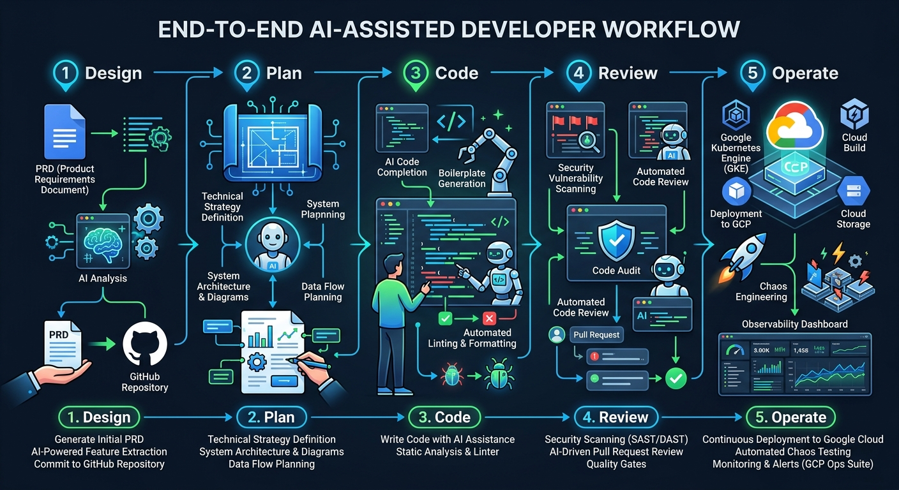
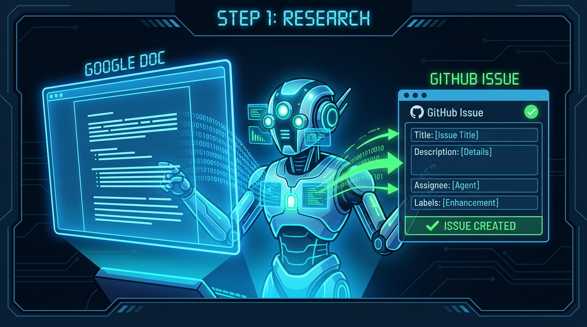
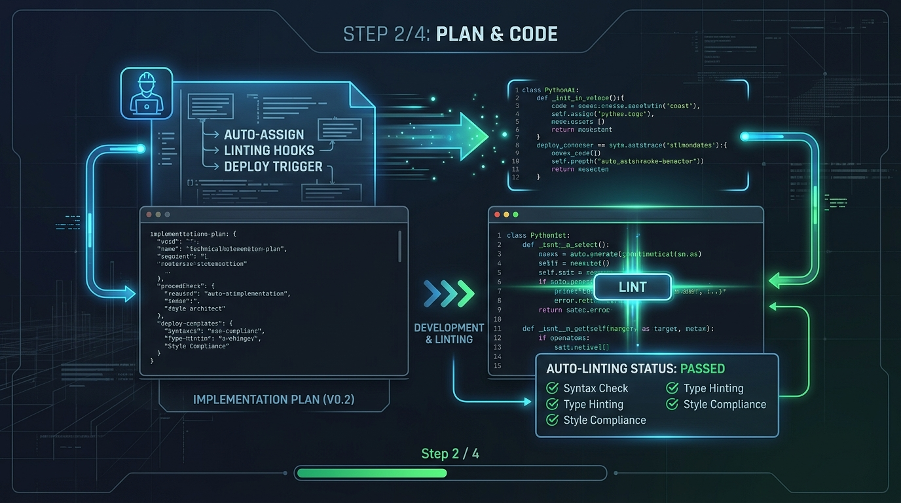
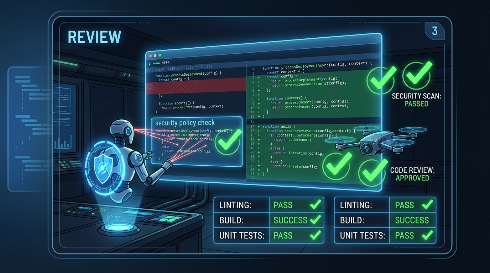
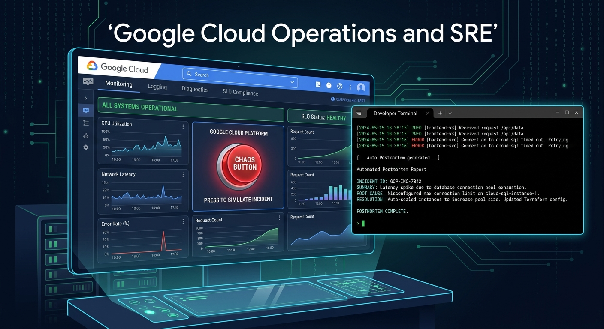

# Daily Extraction: Demo Flow



This document outlines the end-to-end demonstration flow using Gemini CLI, showcasing its integration with Google Workspace, GitHub, local development hooks, agentic code reviews, and Google Cloud Observability.

## 1. Design


**Objective:** Bridge the gap between product management and engineering by extracting requirements from a PRD and creating actionable engineering tasks.
*   **Action:** Provide Gemini CLI with a link to a Google Doc (Product Requirements Document).
*   **Process:** Gemini CLI uses its Google Workspace integration (`gws-docs`) to read the PRD, extracts the core Customer User Journeys (CUJs), and formats them.
*   **Outcome:** Gemini CLI automatically creates a new GitHub Issue detailing the implementation requirements based on the document's context.

Example prompts for Gemini CLI

```
Could you review the PRD `The Daily Extraction - PRD`. What are we trying to achieve?
```

```
How well implemented do you think this PRD is currently?
```

```
Could you create user stories for each of these? Follow good practice. When happy after being reviewed, create github issues for them.
```

## 2. Plan


**Objective:** Translate the high-level GitHub issue into a concrete technical implementation strategy.
*   **Action:** Instruct Gemini CLI to look at the newly created GitHub issue and generate an implementation plan.
*   **Process:** Gemini CLI analyzes the issue requirements against the current state of the codebase (using `codebase_investigator` if necessary) to determine which services and files need to be modified.
*   **Outcome:** A structured, step-by-step plan is agreed upon before any code is written.

```
Analyze GitHub issue #[ISSUE_NUMBER] and the current codebase. Use the codebase_investigator tool to identify relevant services and files. Based on this analysis, generate a concrete technical implementation strategy. Your response must be a structured, step-by-step plan for the modifications required. Do not write any implementation code yet; focus solely on the architectural and file-level plan for approval.
```

Open preview of plan in VSCode (.plan)

## 3. Code
**Objective:** Autonomously implement the feature while adhering to local project standards.
*   **Action:** Authorize Gemini CLI to execute the implementation plan.
*   **Process:** Gemini CLI modifies the codebase (e.g., updating the Barista frontend or one of the backend services). 
*   **Outcome:** As Gemini CLI writes and saves files, local workspace hooks (e.g., `lint-on-change.sh`) automatically trigger in the background to enforce code style and formatting rules immediately.

```
Lgtm, implement the plan
```

As Gemini CLI writes and saves files, local workspace hooks (e.g., `lint-on-change.sh`) automatically trigger in the background to enforce code style and formatting rules immediately.

```
github-workflow
```

## 4. Review


**Objective:** Validate code quality and security posture before deployment.
*   **Action:** Trigger the review agents on the new changes.
*   **Process:** 
    *   Invoke the `code-review` agent to analyze the diff for architectural consistency, performance, and best practices.
    *   Invoke the `security-auditor` agent to scan the modified code for potential vulnerabilities.
*   **Outcome:** Any identified issues are remediated by Gemini CLI (potentially utilizing the `security-plan` and `security-remediation` agents) until the code is clean and secure.

Launch two panes and execute following subagents to review the changes

* Code Review 

```
@code-review
```

* Security Review

```
@security-auditor
@security-plan
@security-remediation 
```


## 5. Operate


**Objective:** Deploy the application and monitor its behavior in the cloud.
*   **Action:** Deploy the verified code and observe telemetry.
*   **Process:** 
    *   Ask Gemini CLI to deploy the changes (which will utilize the project's `./deploy.sh` script).
    *   Interact with the live application to trigger the new feature (and potentially use the app's chaos/error generation capabilities).
    *   Use Gemini CLI's Cloud Observability tools (e.g., `list_log_entries`, `list_group_stats`) to query Google Cloud Logging.
*   **Outcome:** Successfully trace and identify the generated errors or feature usage directly from the terminal without context switching.

Start the issue by pressing the button on the main site

```
We seem to have an issue with the site, user complaints are coming in. Display logs that appear to be an issue 
```

```
Review the logs help me resolve.
```

(hopefully it will call the skill; chaos-mitigation)

```
/mcp list
/mcp desc
```

Show web page again


```
from the troubleshooting process can we improve existing skills or subagents to help speed up next time
```

Create a postmortem for this;

```
write a postmortem for this problem
```

Should leverage skills (postmortem-generator)